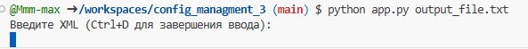
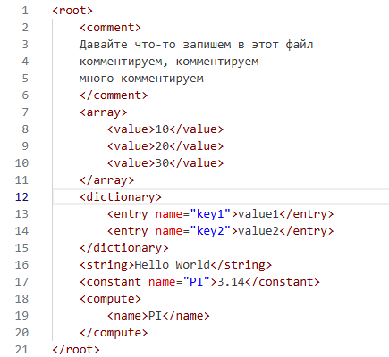
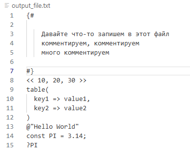
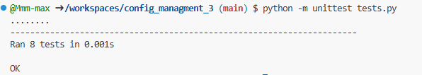

# Задание 3
## Условие

Разработать инструмент командной строки для учебного конфигурационного
языка, синтаксис которого приведен далее. Этот инструмент преобразует текст из
входного формата в выходной. Синтаксические ошибки выявляются с выдачей
сообщений.
Входной текст на языке xml принимается из стандартного ввода. Выходной
текст на учебном конфигурационном языке попадает в файл, путь к которому
задан ключом командной строки.

### Многострочные комментарии:
{#
Это многострочный
комментарий
#}
### Массивы:
<< значение, значение, значение, ... >>
### Словари:
table(
 имя => значение,
 имя => значение,
 имя => значение,
 ...
)
### Имена:
[_a-zA-Z]+
106
### Значения:
• Числа.
• Строки.
• Массивы.
• Словари.
### Строки:
@"Это строка"
### Объявление константы на этапе трансляции:
const имя = значение;
### Вычисление константы на этапе трансляции:
?{имя}


Результатом вычисления константного выражения является значение.
Все конструкции учебного конфигурационного языка (с учетом их
возможной вложенности) должны быть покрыты тестами. Необходимо показать 2
примера описания конфигураций из разных предметных областей.

## Запуск программы
- Для запуска необходимо ввести ```python app.py output_file.txt```, где вместо `output_file.txt` нужно указать выходной файл, в который будет записан код.
- далее программа попросит построчно ввести xml код, по завершении ввода нужно будет нажать ``ctrl+D``



пример запуска программы



Пример входных данных



Пример выходных данных

## Тестирование
На все функции программы, а также некоторые ошибки были наложены юниттесты
Для их запуска нужно ввести  `python -m unittest tests.py`



Результаты unittests